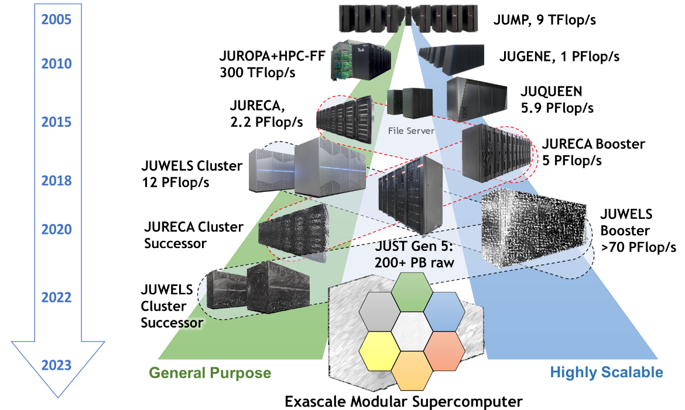
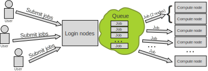
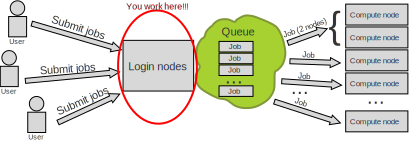
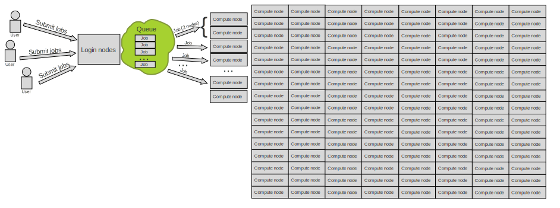
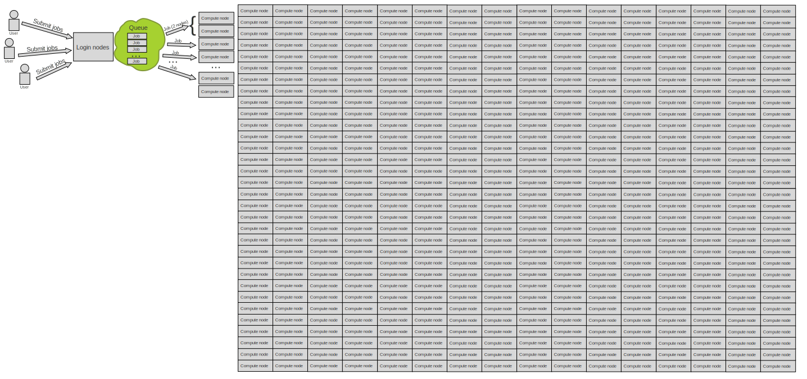
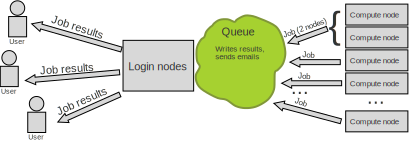
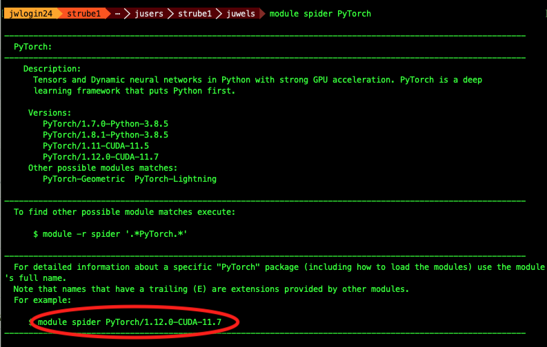
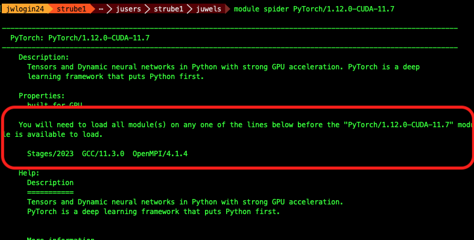

## Communication:

Links for the complimentary parts of this course: 

- [INM Retreat Page](https://events.hifis.net/event/888/page/168-tutorials-17-october-2023)
- [Judoor project page invite](https://judoor.fz-juelich.de/projects/join/training2336)
- [This document: https://helmholtzai-fzj.github.io/2023-deep-learning-for-neuroscience/](https://helmholtzai-fzj.github.io/2023-deep-learning-for-neuroscience/)
- Our mailing list for [AI news](https://lists.fz-juelich.de/mailman/listinfo/ml)
- [Virtual Environment template](https://gitlab.jsc.fz-juelich.de/kesselheim1/sc_venv_template)
- [SOURCE CODE OF THE WHOLE COURSE on Github - Including presentations](https://github.com/HelmholtzAI-FZJ/2023-deep-learning-for-neuroscience)
- [Other courses at JSC](https://go.fzj.de/intro-sc-ai-2023-other-courses)


---

## Goals for this course:

- Make sure you know how to access and use our machines 👩‍💻
- Put your data in way that supercomputer can use it fast 💨
- Distribute your ML workload 💪
- Important: This is _*NOT*_ a basic AI course 🙇‍♂️
  - If you need one, check [fast.ai](https://course.fast.ai)


---

## Team:

::: {.container}
:::: {.col}

::::
:::: {.col}

::::
:::


---

### Note

Please open this document on your own browser! We will need it for the exercises.
[https://go.fzj.de/inm-ml](https://go.fzj.de/inm-ml)

{ width=350px }

---

### Jülich Supercomputers



---

### What is a supercomputer?

- Compute cluster: Many computers bound together locally 
- Supercomputer: A damn lot of computers bound together locally😒
  - with a fancy network 🤯
- Important terms:
  - Login node: It's where you connect and work
  - Compute work: it's where magic happens 🪄🧙
  - No, really, it's just where we compute stuff


---

### JUWELS Booster Compute Nodes

- 936 Compute Nodes
- 2x AMD EPYC Rome 7402 CPU 2.7 GHz (48 cores x 2 threads = 96 virtual cores/node)
- 512 GiB memory
- Network Mellanox HDR infiniband (FAST💨 and EXPENSIVE💸)
- 4x NVIDIA A100 with 40gb 😻
- TL;DR: 89856 cores, 3744 GPUs, 468 TB RAM 💪
- Way deeper technical info at [Juwels Booster Overview](https://apps.fz-juelich.de/jsc/hps/juwels/booster-overview.html)

---

## How do I use a Supercomputer?

- Batch: For heavy compute, ML training
- Interactively: Jupyter

---

### You don't use the whole supercomputer

#### You submit jobs to a queue asking for resources



---

### You don't use the whole supercomputer

#### And get results back



---

### You don't use the whole supercomputer

#### You are just submitting jobs via the login node



---

### You don't use the whole supercomputer

#### You are just submitting jobs via the login node



---

### You don't use the whole supercomputer

#### You are just submitting jobs via the login node


---

### You don't use the whole supercomputer


::: {.container}
:::: {.col}
- Your job(s) enter the queue, and wait for its turn
- When there are enough resources for that job, it runs
::::
:::: {.col}

::::
:::


---

### You don't use the whole supercomputer

#### And get results back



---

### Supercomputer Usage Model
- Using the the supercomputer means submitting a job to a batch system.
- No node-sharing. The smallest allocation for jobs is one compute node (4 GPUs).
- Maximum runtime of a job: 24h.

---

### Recap:

- Login nodes are for submitting jobs, move files, compile, etc
- NOT FOR TRAINING NEURAL NETS

---

### Recap:

- User submit jobs
- Job enters the queue
- When it can, it runs
- Sends results back to user

---

### Connecting to JUWELS BOOSTER

#### Getting compute time
- Go to [https://judoor.fz-juelich.de/projects/join/training2336](https://judoor.fz-juelich.de/projects/join/training2336)
- Join the course project `training2336` (It might take 30+ mins, do it early!)
- Sign the Usage Agreements ([Video](https://drive.google.com/file/d/1mEN1GmWyGFp75uMIi4d6Tpek2NC_X8eY/view))
- Compute time allocation is based on compute projects. For every compute job, a compute project pays.
- Time is measured in core-hours. One hour of Juwels BOOSTER is 48 core-hours.
- Example: Job runs for 8 hours on 64 nodes of Juwels BOOSTER: 8 * 64 * 48 = 24576 core-h!

---

## Connecting to JUWELS BOOSTER

---

#### Jupyter-JSC

- Today we will use the terminal and the code editor from Jupyter-JSC:
  - [https://jupyter-jsc.fz-juelich.de/](https://jupyter-jsc.fz-juelich.de/)
- It's okay if you already have access, just follow along 😇
- { width=350px }

---


---


---


---


---


---

### Jupyter

- Double-click `$PROJECT`
- Double-click `Terminal`

---


---

### Jupyter

- Type `pwd`
- It should be on the course project folder: `/p/project/training2336`

---


---


### Terminal: Exercise

```bash
# Create a shortcut for the project on the home folder
ln -s $PROJECT_training2336 ~/course

# Create a folder for myself
mkdir $HOME/course/$USER

# Enter course folder and
cd $HOME/course/$USER

# Where am I?
pwd

# We well need those later
mkdir $HOME/course/$USER/.cache
mkdir $HOME/course/$USER/.config
mkdir $HOME/course/$USER/.fastai

ln -s $HOME/course/$USER/.cache $HOME/
ln -s $HOME/course/$USER/.config $HOME/
ln -s $HOME/course/$USER/.fastai $HOME/
```

---

## Working with the supercomputer's software

- We have literally thousands of software packages, hand-compiled for the specifics of the supercomputer.
- [Full list](https://www.fz-juelich.de/en/ias/jsc/services/user-support/using-systems/software)
- [Detailed documentation](https://apps.fz-juelich.de/jsc/hps/juwels/software-modules.html)

---

## Software

#### Tool for finding software: `module spider`

```bash
strube1$ module spider PyTorch
------------------------------------------------------------------------------------
  PyTorch:
------------------------------------------------------------------------------------
    Description:
      Tensors and Dynamic neural networks in Python with strong GPU acceleration. 
      PyTorch is a deep learning framework that puts Python first.

     Versions:
        PyTorch/1.7.0-Python-3.8.5
        PyTorch/1.8.1-Python-3.8.5
        PyTorch/1.11-CUDA-11.5
        PyTorch/1.12.0-CUDA-11.7
     Other possible modules matches:
        PyTorch-Geometric  PyTorch-Lightning
...
```

---

## What do we have?

`module avail` (Inside hierarchy)

---

## Module hierarchy

- Stage (full collection of software of a given year)
- Compiler
- MPI
- Module

- Eg: `module load Stages/2023 GCC OpenMPI PyTorch`

---

#### What do I need to load such software?

`module spider Software/version`

---

## Example: PyTorch

Search for the software itself - it will suggest a version



---

## Example: PyTorch

Search with the version - it will suggest the hierarchy



---

## Example: PyTorch

(make sure you are still connected to Juwels BOOSTER)

```bash
$ python
-bash: python: command not found
```

Oh noes! 🙈

Let's bring Python together with PyTorch!

---

## Example: PyTorch

Copy and paste these lines
```bash
# This command fails, as we have no proper python
python 
# So, we load the correct modules...
module load Stages/2023
module load GCC OpenMPI Python PyTorch
# And we run a small test: import pytorch and ask its version
python -c "import torch ; print(torch.__version__)" 
```

Should look like this:
```bash
$ python
-bash: python: command not found
$ module load Stages/2023
$ module load GCC OpenMPI Python PyTorch
$ python -c "import torch ; print(torch.__version__)" 
1.12.0
```
---

## Python Modules

#### Some of the python softwares are part of Python itself, or of other softwares. Use "`module key`"

```bash
module key toml
The following modules match your search criteria: "toml"
------------------------------------------------------------------------------------

  Jupyter: Jupyter/2020.2.5-Python-3.8.5, Jupyter/2021.3.1-Python-3.8.5, Jupyter/2021.3.2-Python-3.8.5, Jupyter/2022.3.3, Jupyter/2022.3.4
    Project Jupyter exists to develop open-source software, open-standards, and services for interactive computing across dozens of programming languages.
    

  PyQuil: PyQuil/3.0.1
    PyQuil is a library for generating and executing Quil programs on the Rigetti Forest platform.

  Python: Python/3.8.5, Python/3.9.6, Python/3.10.4
    Python is a programming language that lets you work more quickly and integrate your systems more effectively.

------------------------------------------------------------------------------------
```
---

## Jupyter

- From the Jupyter's terminal, navigate to your "course" folder and to the name you created earlier.

- ```bash
cd $HOME/course/$USER
pwd
```

- This is out working directory. We do everything here.

---

### Demo code

- Make sure you are on the right folder with the `pwd` command
- Create a new file 
  - Save it with the name `matrix.py`
- Paste this into the file:

---

### matrix.py

``` {.python .number-lines}
import torch

matrix1 = torch.randn(3,3)
print("The first matrix is", matrix1)

matrix2 = torch.randn(3,3)
print("The second matrix is", matrix2)

result = torch.matmul(matrix1,matrix2)
print("The result is:\n", result)
```


---

### How to run it on the login node

```bash
# Load the modules we need for this code

module load Stages/2023
module load GCC OpenMPI PyTorch

# Call the program

python matrix.py
```

---

### But that's not what we want... 😒

---

### So we send it to the queue!

---

## HOW?🤔

---

### SLURM 🤯


Simple Linux Utility for Resource Management

---

### Slurm submission file

- Simple text file which describes what we want and how much of it, for how long, and what to do with the results

---

### Slurm submission file example

File `juwelsbooster-matrix.sbatch`

``` {.bash .number-lines}
#!/bin/bash
#SBATCH --account=training2336           # Who pays?
#SBATCH --nodes=1                        # How many compute nodes
#SBATCH --job-name=matrix-multiplication
#SBATCH --ntasks-per-node=1              # How many mpi processes/node
#SBATCH --cpus-per-task=1                # How many cpus per mpi proc
#SBATCH --output=output.%j        # Where to write results
#SBATCH --error=error.%j
#SBATCH --time=00:01:00          # For how long can it run?
#SBATCH --partition=booster         # Machine partition
#SBATCH --reservation=dl4neurosc # For today only

module load Stages/2023
module load GCC OpenMPI PyTorch  # Load the correct modules on the compute node(s)

srun python matrix.py            # srun tells the supercomputer how to run it
```

---

### Submitting a job: SBATCH

```bash
sbatch juwelsbooster-matrix.sbatch

Submitted batch job 412169
```

---

### Are we there yet?


--- 

### Are we there yet? 🐴

`squeue --me`

```bash
squeue --me
   JOBID  PARTITION    NAME      USER    ST       TIME  NODES NODELIST(REASON)
   412169 gpus         matrix-m  strube1 CF       0:02      1 jsfc013

```

#### ST is status:

- PD (pending), 
- CF(configuring), 
- R (running),   
- CG (completing)

---

### Reservations

- Some partitions have reservations, which means that only certain users can use them at certain times.
- For this course, we have:
- Juwels Booster: `dl4neurosc`

--- 

### Job is wrong, need to cancel

```bash
scancel <JOBID>
```

---

### Check logs

#### By now you should have output and error log files on your directory. Check them!

```bash
# Notice that this number is the job id. It's different for every job
cat output.412169 
cat error.412169 
```

Or simply open it on Jupyter!

---

## Extra software, modules and kernels

#### You want that extra software from `pip`....

[Venv/Kernel template](https://gitlab.jsc.fz-juelich.de/kesselheim1/sc_venv_template)

```bash
cd $HOME/course/$USER
git clone https://gitlab.jsc.fz-juelich.de/kesselheim1/sc_venv_template.git
```

---

## Example: Let's install some software!

- Even though we have PyTorch, we don't have PyTorch Lightning Flash
- Same for fast.ai, gym and wandb
- We will install them in a virtual environment

---

### Example: Let's install some software!

- Edit the file requirements.txt

- Add these lines at the end: 
-
 ```bash
fastai
lightning-flash[image]
gym
wandb
```

- Run on the terminal: `sc_venv_template/setup.sh`

---

### Example: Activating the virtual environment

- `source sc_venv_template/activate.sh`
- `python`
- `import fastai`
- `fastai.__version__`
- ```python
source sc_venv_template/activate.sh 
The activation script must be sourced, otherwise the virtual environment will not work.
Setting vars
The following modules were not unloaded:
  (Use "module --force purge" to unload all):
  1) Stages/2023
The following have been reloaded with a version change:
  1) HDF5/1.12.2-serial => HDF5/1.12.2
python
Python 3.10.4 (main, Oct  4 2022, 08:48:14) [GCC 11.3.0] on linux
Type "help", "copyright", "credits" or "license" for more information.
>>> import fastai
>>> fastai.__version__
'2.7.12'
>>> exit()
```

---

### Let's train a 🐈 classifier!

- This is a minimal demo, to show some quirks of the supercomputer
- Save it as cats.py
- ```python 
from fastai.vision.all import *
from fastai.callback.tensorboard import *
#
print("Downloading dataset...")
path = untar_data(URLs.PETS)/'images'
print("Finished downloading dataset")
#
def is_cat(x): return x[0].isupper()
#
# Create the dataloaders and resize the images
dls = ImageDataLoaders.from_name_func(
    path, get_image_files(path), valid_pct=0.2, seed=42,
    label_func=is_cat, item_tfms=Resize(224))
print("On the login node, this will download resnet34")
learn = vision_learner(dls, resnet34, metrics=accuracy)
#
# Trains the model for 3 epochs with this dataset
learn.unfreeze()
learn.fit_one_cycle(3, cbs=TensorBoardCallback('runs', trace_model=True, projector=True))
```

---

### Submission file for the classifier

#### Save this as `fastai.sbatch`

```bash
#!/bin/bash
#SBATCH --account=training2336
#SBATCH --mail-user=MYUSER@fz-juelich.de
#SBATCH --mail-type=ALL
#SBATCH --nodes=1
#SBATCH --job-name=matrix-multiplication
#SBATCH --ntasks-per-node=1
#SBATCH --cpus-per-task=1
#SBATCH --output=output.%j
#SBATCH --error=error.%j
#SBATCH --time=00:10:00
#SBATCH --partition=booster
#SBATCH --reservation=dl4neurosc # For today only

cd $HOME/course/$USER
source sc_venv_template/activate.sh # Now we finally use the fastai module

srun python cats.py
```

--- 

### Submit it

`sbatch fastai.sbatch`

---

### Submission time

- Check error and output logs, check queue

---

### Probably not much happening...

- ```bash
$ cat output.7948496 
The activation script must be sourced, otherwise the virtual environment will not work.
Setting vars
Downloading dataset...
```
- ```bash
$ cat err.7948496 
The following modules were not unloaded:
  (Use "module --force purge" to unload all):

  1) Stages/2023
```

---

## 💥

---

## What happened?

- It might be that it's not enough time for the job to give up
- Check the `error.${JOBID}` file
- If you run it longer, you will get the actual error
- Long error message which ends with
- ```python
  File "/p/software/juwelsbooster/stages/2023/software/Python/3.10.4-GCCcore-11.3.0/lib/python3.10/urllib/request.py", line 1391, in https_open
    return self.do_open(http.client.HTTPSConnection, req,
  File "/p/software/juwelsbooster/stages/2023/software/Python/3.10.4-GCCcore-11.3.0/lib/python3.10/urllib/request.py", line 1351, in do_open
    raise URLError(err)
urllib.error.URLError: <urlopen error [Errno 111] Connection refused>
srun: error: jsfc013: task 0: Exited with exit code 1
```

---

## 🤔...

---

### What is it doing?

- This downloads the dataset:
- ```python
path = untar_data(URLs.PETS)/'images'
```

- And this one downloads the pre-trained weights:
- ```python
learn = vision_learner(dls, resnet34, metrics=error_rate)
```

---


## Remember, remember


---

## Remember, remember


---

## Compute nodes have no internet connection

- But the login nodes do!
- So we download our dataset before...
  - On the login nodes!

---


## On the login node:

- Comment out the line which does AI training:
- ```python
# learn.fit_one_cycle(3, cbs=TensorBoardCallback('runs', trace_model=True))
```
- Call our code on the login node!
- ```bash
source sc_venv_template/activate.sh # So that we have fast.ai library
python cats.py
```

---

## Run the downloader on the login node

```bash
$ source sc_venv_template/activate.sh
$ python fastai-demo.py 
Downloading dataset...
 |████████-------------------------------| 23.50% [190750720/811706944 00:08<00:26]
 Downloading: "https://download.pytorch.org/models/resnet34-b627a593.pth" to /p/project/ccstao/cstao05/.cache/torch/hub/checkpoints/resnet34-b627a593.pth
100%|█████████████████████████████████████| 83.3M/83.3M [00:00<00:00, 266MB/s]
```

---

## Run it again on the compute nodes!

- Un-comment back the line that does training:
- ```bash
learn.fit_one_cycle(3, cbs=TensorBoardCallback('runs', trace_model=True))
```
- Submit the job!
- ```bash
sbatch fastai.sbatch
```

---

## Masoquistically waiting for the job to run?

```bash
watch squeue --me
```
(To exit, type CTRL-C)

---

## Check output files

- You can see them within Jupyter
- ```bash
The activation script must be sourced, otherwise the virtual environment will not work.
Setting vars
Downloading dataset...
Finished downloading dataset
epoch     train_loss  valid_loss  error_rate  time    
Epoch 1/1 : |-----------------------------------| 0.00% [0/92 00:00<?]
Epoch 1/1 : |-----------------------------------| 2.17% [2/92 00:14<10:35 1.7452]
Epoch 1/1 : |█----------------------------------| 3.26% [3/92 00:14<07:01 1.6413]
Epoch 1/1 : |██---------------------------------| 5.43% [5/92 00:15<04:36 1.6057]
...
....
Epoch 1/1 :
epoch     train_loss  valid_loss  error_rate  time    
0         0.049855    0.021369    0.007442    00:42     
```

- 🎉
- 🥳

---

### Tools for results analysis

- We already ran the code and have results
- To analyze them, there's a neat tool called Tensorboard
- And we already have the code for it on our example!
- ```python
learn.fit_one_cycle(3, cbs=TensorBoardCallback('runs', trace_model=True))
```

---

## Jupyter and TensorBoard

- On Jupyter, make sure you are on the $PROJECT/YOUR USER folder
- Right click on the files list and choose `New Notebook`
- It will ask you for a kernel - Choose PyDeepLearning 2023.05
- 
---

## TensorBoard:

- On Jupyter's notebook:
- ```bash
import random
MYPORT = random.randint(10000, 15000)
%load_ext tensorboard
%tensorboard --logdir /p/project/training2336/strube1/runs --port $MYPORT
```

---

### Tensorboard on Juwels Booster


---

## Part 1 recap

As of now, I expect you managed to: 

- Stay awake for the most part of this morning 😴
- A working jupyter connection to the supercomputers 🖥️
- Can edit and transfer files via Jupyter 📝
- Submit jobs and read results 📫
- Access tensorboard on the login nodes 🧙‍♀️
- Is ready to make great code! 💪

---

## ANY QUESTIONS??

#### Feedback is more than welcome!

---