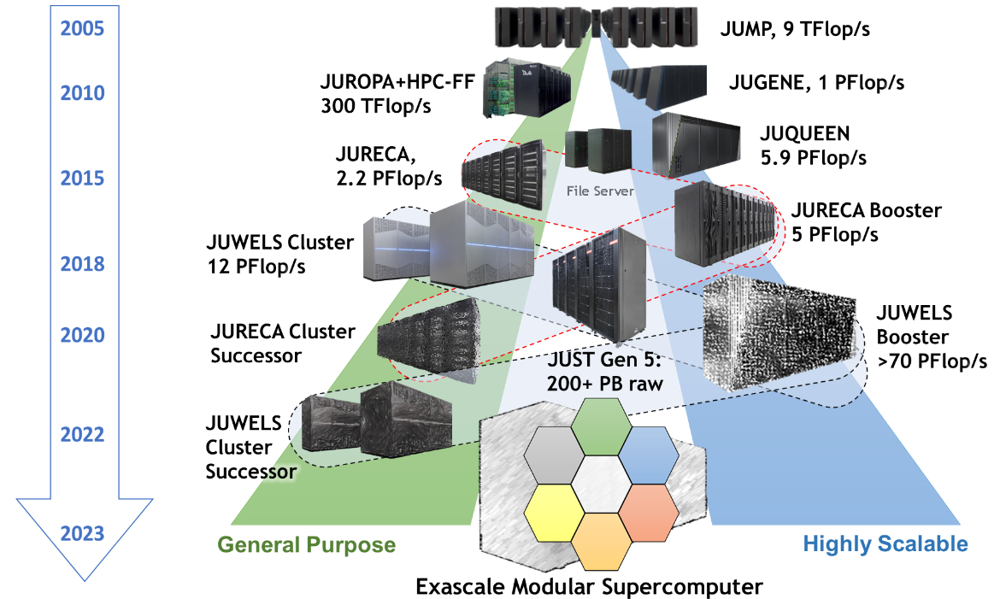

### Schedule for day 2

| Time          | Title                |
| ------------- | -----------          |
| 09:00 - 09:15 | Welcome, questions   |
| 09:15 - 10:30 | Speedup data loading |
| 10:30 - 11:00 | Coffee Break (flexible) |
| 10:30 - 13:00 | Parallelize Training |

---

## I/O is separate and shared

#### All compute nodes of all supercomputers see the same files

- Performance tradeoff between shared acessibility and speed
- It's simple to load data fast to 1 or 2 gpus. But to 100? 1000? 10000?

---

### Jülich Supercomputers

- Our I/O server is almost a supercomputer by itself
- 

---

## Data services

- JSC provides different data services
- Data projects give massive amounts of storage
- We use it for ML datasets. Join the project at [Judoor](https://judoor.fz-juelich.de/projects/join/datasets)
- After being approved, connect to the supercomputer and try it:
- ```bash
cd $DATA_datasets
```

---

## Data Staging

- [LARGEDATA filesystem](https://apps.fz-juelich.de/jsc/hps/juwels/filesystems.html) is not accessible by compute nodes
- Copy files to an accessible filesystem BEFORE working
- Imagenet-21K copy alone takes 21+ minutes to $SCRATCH

---

## Data loading


--- 

## Strategies

- We have CPUs and lots of memory - let's use them
    - multitask training and data loading for the next batch
    - `/dev/shm` is a filesystem on ram - ultra fast ⚡️
- Use big files made for parallel computing
    - HDF5, Zarr, mmap() in a parallel fs, LMDB
- Use specialized data loading libraries
    - FFCV, DALI
- Compression sush as squashfs 
    - data transfer can be slower than decompression (must be checked case by case)
    - Beneficial in cases where numerous small files are at hand.

---

## Libraries

- FFCV [https://github.com/libffcv/ffcv](https://github.com/libffcv/ffcv) and [FFCV for PyTorch-Lightning](https://github.com/SerezD/ffcv_pytorch_lightning)
- Nvidia's DALI [https://developer.nvidia.com/dali](https://developer.nvidia.com/dali)

---

The ImageNet dataset
```bash
`-- ILSVRC
    |-- Annotations
    |   `-- CLS-LOC
    |       |-- train
    |       |   |-- n01440764
    |       |   |-- n01443537
    |       |   |-- n01484850
    |       |   |-- n01491361
    |       |   |-- n01755581
    |       |   |-- ....
    |       `-- val
    `-- Data
        `-- CLS-LOC
            |-- imagenet_labels.pkl
            |-- imagenet_val.pkl
            `-- train
                |-- n01697457
                |   |-- n01697457_10012.JPEG
                |   |-- n01697457_10016.JPEG
                |   |-- n01697457_1004.JPEG
                |   |-- n01697457_1005.JPEG
                |   |-- n01697457_10072.JPEG
                |   |-- ...
                |-- n01740131
                |   |-- n01740131_10044.JPEG
                |   |-- n01740131_10045.JPEG
                |   |-- n01740131_10052.JPEG
                |   |-- n01740131_10054.JPEG
                |   |-- n01740131_10057.JPEG
                |   |-- ...
                |-- ...
```             
---

## Some imports 

```python
import os 
from io import BytesIO
import argparse
import json
import h5py

from torch.utils.data import Dataset, DataLoader
from torchvision import transforms

from PIL import Image
```

---

## Data Augmentation

```python
def transformation():
    _IMAGE_MEAN_VALUE = [0.485, 0.456, 0.406]
    _IMAGE_STD_VALUE = [0.229, 0.224, 0.225]
    
    return dict(
        train=transforms.Compose([
            transforms.ToTensor(),
            transforms.Resize((256, 256)),
            transforms.RandomCrop(224),
            transforms.RandomHorizontalFlip(),
            
            transforms.Normalize(_IMAGE_MEAN_VALUE, _IMAGE_STD_VALUE)
        ]),
        val=transforms.Compose([
            transforms.ToTensor(),
            transforms.Resize((224, 224)),

            transforms.Normalize(_IMAGE_MEAN_VALUE, _IMAGE_STD_VALUE)
        ]),
        test=transforms.Compose([        
            transforms.ToTensor(),
            transforms.Resize((224, 224)),
            transforms.Normalize(_IMAGE_MEAN_VALUE, _IMAGE_STD_VALUE)
        ]))
```

---

## ImageNet class

```python
class ImageNet(Dataset):
    def __init__(self, root, split, transform=None):
        self.samples = []
        self.targets = []
        self.transform = transform[split]
        self.syn_to_class = {}

        with open(os.path.join(root, "imagenet_class_index.json"), "rb") as f:
            json_file = json.load(f)
            for class_id, v in json_file.items():
                self.syn_to_class[v[0]] = int(class_id)

        with open(os.path.join(root, "ILSVRC2012_val_labels.json"), "rb") as f:
            self.val_to_syn = json.load(f)

        samples_dir = os.path.join(root, "ILSVRC/Data/CLS-LOC", split)
        for entry in os.listdir(samples_dir):
            if split == "train":
                syn_id = entry
                target = self.syn_to_class[syn_id]
                syn_folder = os.path.join(samples_dir, syn_id)
                for sample in os.listdir(syn_folder):
                    sample_path = os.path.join(syn_folder, sample)
                    self.samples.append(sample_path)
                    self.targets.append(target)
            elif split == "val":
                syn_id = self.val_to_syn[entry]
                target = self.syn_to_class[syn_id]
                sample_path = os.path.join(samples_dir, entry)
                self.samples.append(sample_path)
                self.targets.append(target)

        
    def __len__(self):
        return len(self.samples)

```

---

```python
    def __getitem__(self, idx):
        x = Image.open(self.samples[idx]).convert("RGB")
        if self.transform:
            x = self.transform(x)
        return x, self.targets[idx]
```

---

## Access ImageNet images

```python
parser = argparse.ArgumentParser()
parser.add_argument("--data_root", type=str, default="/p/scratch/training2324/data/")
parser.add_argument("--batch_size", type=int, default=2048)
args = parser.parse_args()

image_datasets = ImageNet(args.data_root, "train",  transformation()) 
dataloaders = DataLoader(image_datasets, batch_size=args.batch_size, \
    num_workers=int(os.getenv('SLURM_CPUS_PER_TASK')),  pin_memory=True)

print("Start loading ImageNet images")
for x in dataloaders:
    pass
```

```bash 
elapsed: 00 hours 07 min 29 sec
```     

---

## H5 file


---

## Use H5 file

```python
class ImageNetH5(Dataset):

    def __init__(self, data_root, split, transform=None):

        self.imgs = h5py.File(os.path.join(data_root, "ImageNetFinal.h5"), 'r')[split] 
    
        self.targets = []
        self.transform = transform[split]
        self.syn_to_class = {}

        with open(os.path.join(data_root, "imagenet_class_index.json"), "rb") as f:
            json_file = json.load(f)
            for class_id, v in json_file.items():
                self.syn_to_class[v[0]] = int(class_id)

        with open(os.path.join(data_root, "ILSVRC2012_val_labels.json"), "rb") as f:
            self.val_to_syn = json.load(f)

        samples_dir = os.path.join(data_root, "ILSVRC/Data/CLS-LOC", split)
        for entry in os.listdir(samples_dir):
            if split == "train":
                syn_id = entry
                target = self.syn_to_class[syn_id]
                syn_folder = os.path.join(samples_dir, syn_id)
                for sample in os.listdir(syn_folder):
                    self.targets.append(target)
            elif split == "val":
                syn_id = self.val_to_syn[entry]
                target = self.syn_to_class[syn_id]
                self.targets.append(target)

    def __len__(self) -> int:
        return self.imgs["images"].shape[0]

```

---

```python
    def __getitem__(self, index: int):
        img_string = self.imgs["images"][index]

        with BytesIO(img_string) as byte_stream:
            img = Image.open(byte_stream)
            img = img.convert("RGB")

        if self.transform:
            img = self.transform(img)
    
        return img, self.targets[index]
```

---

## Use H5 file

```python
parser = argparse.ArgumentParser()
parser.add_argument("--data_root", type=str, default="/p/scratch/training2324/data/")
parser.add_argument("--batch_size", type=int, default=2048)
args = parser.parse_args()

image_datasets = ImageNetH5(args.data_root, "train", transformation()) 
dataloadersh5= DataLoader(image_datasets, batch_size=args.batch_size, \
    num_workers=int(os.getenv('SLURM_CPUS_PER_TASK')), pin_memory=True)

print("Start loading with H5 file")
for x in dataloadersh5:
    pass
```

```bash 
elapsed: 00 hours 03 min 48 sec
```    

---

## Demo

Please clone the repository provided by the link bellow

git clone https://gitlab.jsc.fz-juelich.de/MLDL_FZJ/juhaicu/jsc_public/sharedspace/teaching/2023-getting-started-with-ai-on-supercomputers.git  
